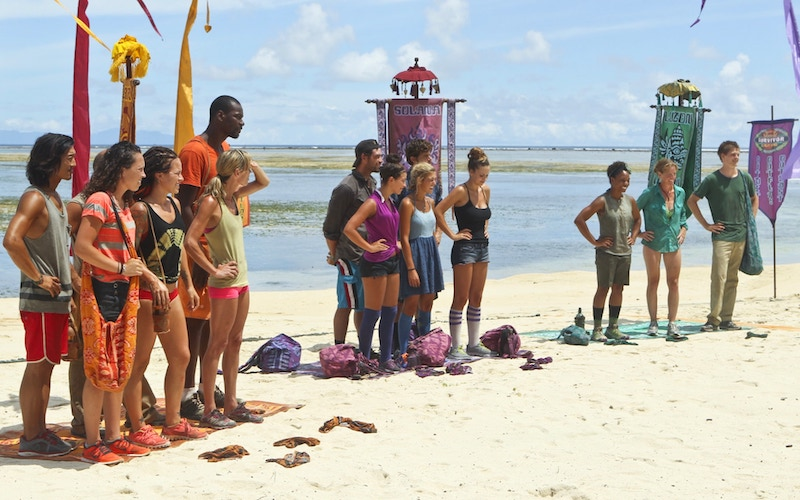
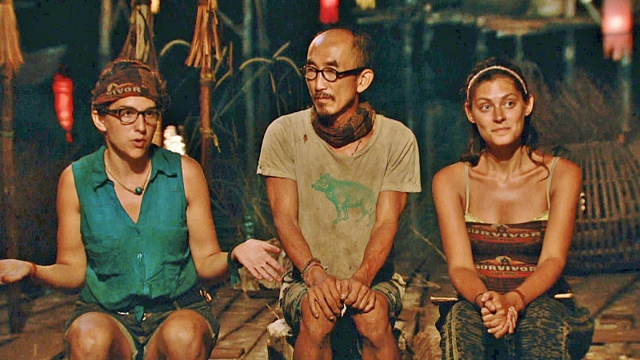

```{r setup, include=FALSE}
knitr::opts_chunk$set(
	eval = FALSE,
	echo = TRUE,
	message = FALSE,
	warning = FALSE
)
library(survivoR)
library(tidyverse)
library(gridExtra)
library(nnet)
library(ALEPlot)
library(caret)

source("2-1_fns_normalized.R")
source("5_clustering.R")
```



# Motivation

As I was winding down after the finals week watching *Survivor: Africa*, which marks the 22nd season I have seen of the reality TV competition series Survivor, I was once again theorizing about who among the cast was going to make it to the top this time around. As a fan of this show, I get very invested in trying to figure out the logic that underlies the personal relationships and strategic moves in the game, all for the sole purpose of making it to the end and getting a shot at winning the $1 million cash prize.

The reason why I love this show so much is that the game environment exposes so much about our psyche, and as with anything involving human psychology, what happens in the game is always so unpredictable. My personal goal embarking on this project was to try to estimate what kind of factors contribute to what level when the game comes to a close and a winner is announced.

# I. *Survivor US*

Survivor is a popular show and it's easy to understand why. The rules of the game are very simple, it's a proven formula, and it keeps the fans of the show coming back for more. As with any other TV series finishing up their 40th season, there are only a handful aspects of the game that show producers haven't tried to tinker with over the course of the last 20 years to keep things fresh. But the base rules are the same.

16 to 20 castaways are placed in a remote location and divided up into tribes. The goal? Making it to the end of the 39 days of the game without getting voted off, whether that is through winning immunity challenges to keep you safe from votes, or making alliances to vote with, not against, you. At the end of the 39 days, only 3 (or 2) survivors stand to make their case to the jury as to why they should claim the title of sole survivor and the $1 million prize. This is where it gets interesting. The jury is 7-10 castaways that were most recently voted out of the tribe. So your job as a finalist now is to convince the people you had a hand in voting out why they should write you in as their winner.

```{r, out.width = "320px", echo=FALSE, eval=TRUE, fig.align='center'}

```


The general consensus among the fans as well as the previous castaways is that there is always a great deal of luck involved in deciding who makes it to the end. So in this project I decided to solely focus on the finalists of the game, the two or three survivors standing at the end with different (or similar) styles of game play for each other. When the power shifts to the jury, what are the qualities of a finalist that helps or hinders them in their pursuit of winning the game? Can I somehow quantify aspects of how these finalists played the game that would allow me to compare them to each other, regardless of what season they come from?

# II. Descriptive statistics, feature engineering

Data was obtained from ```survivoR``` package in R, available at the public Github repo [**doehm/survivoR**](https://github.com/doehm/survivoR).

## Primary features

Here are the primary features that I considered:

* **Age**: Instead of using raw age, I took Z-scores of ages within each season. So it would be more accurately called 'relative age within season'.

* **Immunity idols won** (`necklaces`): This was one of the variables I was personally curious about, because there have been winners that were very dominant in the challenges and won lots of immunity idols, but many winners famously have won without getting a single immunity idol (one particular castaway managed it twice).

\newpage

* **Appearance**: Many previous contestants return to play other seasons, and being a returning player might influence jury's decision to award you with the title, depending on if they view it positively or not.

* Date of final tribal council: I have access to the dates that each season's jury would be making their decisions (day 39 of filming) to control for a seasonal effect, but for now I did not add this in the model.


```{r eval=TRUE, echo=FALSE}
df <- df %>% 
  mutate(relevance=case_when(jury==1 ~ "jury",
                             ftc==1 ~ "finalist")) %>% 
  filter(!is.na(relevance))

grid.arrange(ggplot(df, aes(age)) + geom_density(aes(col = relevance)) + 
labs(title = "Jury & finalists are the same age") +
theme(legend.position = "none"),
  
ggplot(df, aes(immunity_idols_won)) + geom_density(aes(fill = relevance),
                                           position="dodge") + 
labs(title = "Unequal idol distribution") +
theme(legend.position = c(0.8, 0.8)) + labs(fill=NULL),

ncol=2)
```

The age distribution is identical for finalists and jury, but the distribution of the immunity idols suggest that most finalists have won the idol at least once, whereas majority of the jury members never had. 

## Derived features

* **Original tribe representation** (`prevtribe_jury`): These feature looks at the importance of day 1 bonds; it is the percentage of jury members who were in the same tribe as the finalist.

Next two features were designed in my interest to somehow incorporate finalists' voting histories in the model. `survivoR` package also has a voting history table, through which I was able to extract a matrix of "vote vectors" for each jury member and finalist per each season. 

Here is what I had for season 6: The Amazon.

```{r, echo=FALSE, eval=TRUE, include=FALSE}
seasonno =6
p <- getSeasonSummary(seasonno) %>% 
  as.matrix()
rownames(p) <- p[,1]
p <- p[,-1]
jury <- survivors %>% filter(season==seasonno, jury==1) %>% pull(castaway)
final <- survivors %>% filter(season==seasonno, ftc==1) %>% pull(castaway)
```

```{r, echo=TRUE, eval=TRUE, include=TRUE}
p[final,8:14]
```

\newpage

```{r, echo=TRUE, eval=TRUE, include=TRUE}
p[jury,8:14]
```

* **Jury similarity index** (`jury_simil`): This variable quantifies how similar the finalist voted compared to the jury members. The idea is that if the similarity index is high, that means the finalist was likely in alliances with the jury members or simply aligning interests with them. How does clashing or matching voting histories affect jury's decision? In calculation, `jury_simil` is the average Jaccard index between a finalist and each jury member.

* **Majority vote percentage** (`majorityvote`): The idea for this variable came from the final trouble council at Season 33 when a finalist was asked by a jury member how many times she was a part of the majority vote. How I interpret this is that if your vote belonged to the majority's most of the time, then you likely had a good grasp of the game, command over tribe mates and successful alliance management. How does the jury value being the dominant force vs. the underdog?


# III. Clustering

Just for the fun of it, since I have all this normalized data now, I decided to see if I can come up with a cluster solution that could help me gain some insight as to how I can group these finalists together.

K-means clustering gave solutions that maximized the F-score at $K=4$.

```{r eval=TRUE, echo=FALSE}
mat <- df_norm %>% 
  select(age, necklaces, appearance, 
         jury_simil, prevtribe_jury, majorityvote) %>% 
  as.matrix()

kfit <- kmeans(mat, 4, nstart=100, iter.max = 100) 

plot.kmeans(kfit)
```

As I made the warning previously, these interpretations will be heavily colored by my personal opinions, but here is how I see it.

1. This is a cluster of young finalists who came to the final collecting tons of individual immunities. Example: Kelly from Borneo, Fabio from Nicaragua

2. These finalists were probably in the majority most of their time and as a result, voted very much like the jury members who were probably in the finalist's alliance. Example: Amanda & Parvati from Micronesia, Rob from Redemption Island

3. Older returning players who made tons of big moves against the majority and voted against most of the jury members. Example: Russell & Parvati from Heroes v Villains

4. Players who didn't win many individual immunities and relied on their alliances to carry them through. Example: Courtney from China, Sandra from Pearl Islands

```{r, eval=TRUE, echo=FALSE}
df_norm %>% 
  mutate(cluster = kfit$cluster,
         winner=as.numeric(winner)) %>% 
  group_by(cluster) %>% 
  summarise(winrate=sum(winner)/n())
```

Surprisingly, or unsurprisingly, real life data says cluster 1 and 4 became more successful in their quest. I'll leave the interpretation to other Survivor fans.

Just to test the validity of my solution, I did dimensionality reduction through PCA, plotted the PC-scores and individually colored the clusters.

```{r, eval=TRUE, echo=FALSE, out.width='300px'}
par(mfrow=c(1,2))

grid.arrange(df_norm %>% 
  mutate(PC1 = factors$scores[,1],
         PC2 = factors$scores[,2],
         PC3 = factors$scores[,3],
         cluster = factor(kfit$cluster)) %>% 
  ggplot(aes(x=PC1, y=PC2)) + geom_point(aes(color=cluster)) +
  theme(legend.position = c(0.7, 0.95), legend.direction="horizontal") + labs(color=NULL),

df_norm %>% 
  mutate(PC1 = factors$scores[,1],
         PC2 = factors$scores[,2],
         PC3 = factors$scores[,3],
         cluster = factor(kfit$cluster)) %>% 
  ggplot(aes(x=PC3, y=PC2)) + geom_point(aes(color=cluster)) +
  theme(legend.position = "none"),

ncol=2)
```

This is kind of like looking at two different sides of a cube. The clusters are not very immediate, but they served their explanatory purpose for now.

\newpage

# IV. Modeling

All statistical learning models were selected and tuned through *n*-fold cross validation. Here was the algorithm: The model is trained on finalists from all seasons but one. The predicted probabilities of winning for the left-out season finalists are obtained from the trained model, and the person with the highest probability in the final 2 or final 3 is declared the winner. 

I considered various models but eventually landed on a neural network with logistic outputs. I ran into issues with nonlinear models like boosted trees and k-nearest neighbors where the model was yielding equal win probabilities and hence predicting multiple winners per season. Neural network predictions did not have the same issue.

I used the `nnet` package to fit the model, and tuned hidden layer nodes and regularization parameter to minimize the misclass rate.

```{r, eval=TRUE, echo=FALSE}
matrix(c(0.4476190, 0.4380952, 0.4571429, 0.4190476, 0.4190476, 0.4761905, 0.4761905, 0.4761905,
         0.4761905, 0.4571429, 0.4380952, 0.4380952, 0.4380952, 0.4761905, 0.4761905, 0.4761905,
         0.4476190, 0.4571429, 0.5142857, 0.4952381, 0.4380952, 0.4761905, 0.4761905, 0.4761905),
       byrow=T,
       nrow=3,
       dimnames=list(paste(1:3, "nodes"), c("lambda=0.004", 0.012, 0.037, 0.111, 0.333, 1, 3, 9)))
```

Best tuning parameters & options turned out to be the following:

```
size=2
decay=0.037
linout=FALSE
maxit=1000
skip=FALSE
```

Now that we have a tuned model, what can we learn from it? We can look at relative feature importance to see which variables have the largest contribution in predictions. I'll use `caret` package, which uses Recursive Feature Elimination (RFE) to determine the importance measures.


```{r, echo=FALSE, eval=TRUE}
set.seed(125)
train <- df_norm[,-(1:3)]

final_nn <- nnet(winner~., size=2, data=train, 
                  maxit=1000, decay=0.037, skip=FALSE, trace=FALSE)
arrange(varImp(final_nn), desc(Overall))
```

And we can also use partial dependence plots (I use ALE plots here) to see the isolated effects of each variable.

```{r, echo=FALSE, eval=TRUE}
yhat <- function(X.model, newdata) as.numeric(predict(X.model, newdata, type="raw", n.trees=2))
par(mfrow=c(2,4))
for (j in 1:7)  {
  ALEPlot(as.data.frame(train[,-1]), final_nn, pred.fun=yhat, J=j, K=50, NA.plot = TRUE)
}
```

It is slightly annoying to interpret the variables since the scales are normalized, but we can look at the curve to provide some explanations.

* **Age** follows a roughly linear trajectory, meaning younger finalists are more likely to win the show. 

* **`majorityvote`** has a very interesting curve. Win probability is maximized at a little below the average and sharply declines as `majorityvote` approaches 1. The way I see it is that players who didn't always vote with the majority are favored, but not to the extent where the percentage is extremely low (if a finalist never knew what was going on and always voted against the crowd, that's viewed negatively.) But when the percentage is too high, close to 100%, then the finalist is probably viewed by the jury as cunning and devious which also works against the finalist's favor.

* **Number of immunity idols** (`necklaces`) was probably the most surprising here, where fewer idols didn't have a positive effect (if you see the scale for `x_2 (necklaces)`, main effect at y-axis at the lower end is 0) but more idols hurt the finalists' chances.

* **Appearance** didn't appear to be one of the more important variables, and it is most likely heavily influenced by one particular data point for Season 22 when Rob "Boston Rob" Mariano won Survivor on his 4th try.

# V. Bootstrap estimates

Now that I have my model tuned, I can repeat this a bunch of times! For each season, I will generate 10000 predictions of who the winner is going to be, with a model trained on a resampling with replacement of the 39 other seasons. That is a whopping 400,000 neural networks fit! Thankfully I was able to set up this code to run on the MSiA servers overnight.

\newpage

```{r, include=TRUE}
no.reps <- 10000
yhat=matrix(0,105,no.reps)

for (k in 1:40) {
  test_ind <- filter(df_norm, season == k) %>% pull(sid)
  
  for (i in 1:no.reps) {
    seasons <- sample((1:40)[-k], 39, replace=TRUE)
    
    train <- data.frame()
    for (a in seasons) train <- rbind(train, filter(df_norm, season==a))
    train <- train[,4:11]
    
    out <- nnet(winner~., size=2, data=train, linout=F, maxit=1000, 
                          decay=0.037, skip=FALSE, trace=FALSE)
    yhat[test_ind,i] <- generateWinner(k, out, type="raw")
  }
}
```

Winner                 Season                   Predicted%
----------------   -----------------------   ----------------
Chris Daugherty       9: Vanuatu                91.6
Ethan Zohn            3: Africa                 88.0
Jenna Morasca         6: The Amazon             87.2
Sandra Diaz-Twine     7: Pearl Islands          82.0
J.T. Thomas           18: The Tocantins         79.9
-----------------   -----------------------   ----------------


Winner                 Season                               Predicted%
----------------   ---------------------------------   ----------------
Jeremy Collins      31: Cambodia - Second Chance               4.5
Yul Kwon            13: Cook Islands                        8.7
Tony Vlachos        28: Cagayan                           12.7
Bob Crowley         17: Gabon                           13.3
Richard Hatch       1: Borneo                           14.1
-----------------   -------------------------------   ----------------

How should we interpret these results? The way I look at it is, since the predictions for each season are done using a model trained on the other 39, a high `predicted%` indicates that the way the finalist played "a textbook game". The model says Chris from Vanuatu or Ethan from Africa had a gamestyle possibly similar to those we saw before, and the previous contestants that played like they did usually won.

For Jeremy and Yul, the opposite. They were possibly in the finals with a textbook contestant, and the model saw Jeremy winning only 450 out of 10000 simulations of the season. Against all odds, these winners were able to snatch the title in the end.

Another interesting table to look at is the non-winners with the highest `predicted%`.

Non-winner finalist                 Season                      Predicted%
---------------------   ---------------------------------   ----------------
Spencer Bledsoe             31: Cambodia - Second Chance           91.5
Woo Hwang                  28: Cagayan                             87.3
Kelly Wiglesworth             1: Borneo                            85.9
Sugar Kiper                   17: Gabon                            83.9
Colby Donaldson               2: The Australian Outback            76.2
---------------------   ----------------------------------   ----------------

The model says these shoo-ins could not convince the jury. Kelly and Colby came to the end with lots of immunity idols won along the way, but they lost. For Spencer and Woo, it is hard to tell. Woo was likely favored due to the fact that he was in the majority vote most of the time, and Spencer was relatively young at 23 when he played in *Season 31: Cambodia - Second Chance*, a returning player season with most contestants in their 30s and 40s.


<!-- Tableau plot with seasonal marginal difference and whether I got it right or not -->


# Conclusions

This exercise was less about building the best predictive model to help me hit the jackpot at `bets.com` for season 41, and more about coming to understand various intricacies of gameplay and strategy within the realm of my favorite TV show. Normally, I don't care much to interpret what a statistical model predicts a historical datapoint, but in the case of this particular dataset, one datapoint is a 13-episode season with story arcs, big personalities and iconic challenges, so reviewing the output of my n-fold cross validation was actually enjoyable for once. I feel like I gained some understanding as to what some past winners had to set them apart from the rest, and how each of these winners fit in with each other.

In any case, you can find me watching Survivor in my Engelhart apartment until I finish all 40 seasons.
